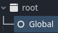
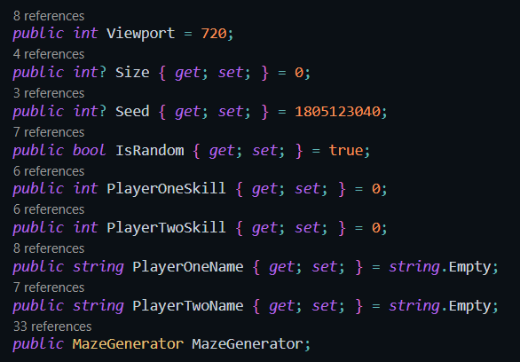
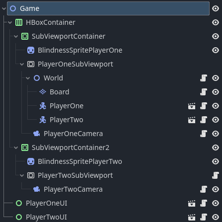
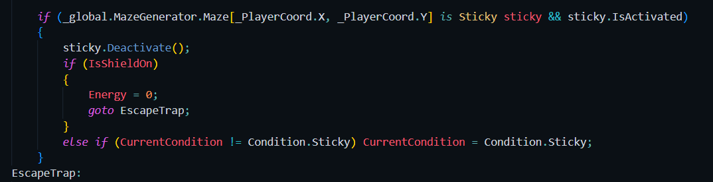
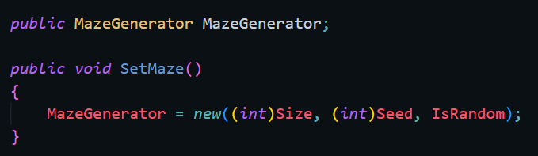
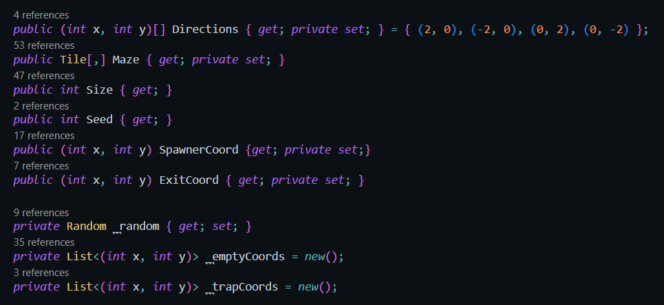
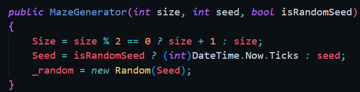

# INFORME

Proyecto de la asignatura de Programación de Ciencia de la Computación.

> Hecho en Godot v4.3.stable.mono.official [77dcf97d8].

## Resumen

El juego solo se puede jugar para dos personas, enemigos entre sí. El objetivo es llegar a la salida antes que el oponente, en un laberinto generado por partida. Habrá trampas que van entorpecer a los jugadores, quitandoles ventaja y dominio sobre el laberinto. Contrarestarlas es el uso principal de las habilidades de las fichas a elegir.

Las habilidades son únicas por ficha, y hay 5 para elegir. Los jugadores las usan para esquivar contra las trampas o desfavorecer al oponente.

## Godot Engine

Godot usa un sistema de nodos para administrar cada elemento del proyecto

---

### Escenas

El proyecto consiste en las escenas:

- `Menú`

  > Menú del juego , permite la elección de iniciar o abandonar el juego.

- `Editor`

  > Editor de la partida, permite elegir las fichas y la generación del laberinto.

- `Game`

  > Donde ocurre la partida

- `Player`

  > Base de los jugadores.

- `Player UI`

  > Base de la interfaz visual de cada jugador.

- `Game Over`

  > Final de la partida, permite reiniciar con la misma configuración o volver al Menú.

---

### Global

_Godot_ tiene una función llamada _Autoload_ que permite cargar un _script_ en un nodo hijo del nodo _root_ durante todo el proceso del juego.

Por eso en algunos scripts habrá una referencias al [Global](../Scripts/Global.cs). En este se guardará las variables a usar entre escenas.

---

### Menú

Al abrir el juego, se presentará por el Menu junto al título. Si la decisión es iniciar un nuevo juego, entonces te enviará al `Editor`.
Los botones funcionan gracias a una funcionalidad de Godot llamada Signals, que permite provocar eventos según ocurre una acción.

- `New Game`

  > Inicia el juego.

- `Quit`

  > Abandona el juego.

---

Esta escena contiene un solo _script_ [Menu](../Scripts/Menu.cs).

---

### Editor

Su función es poder configurar la partida. Sus opciones son:

1. Cambiar el nombre del jugador 1, escribiendo sobre el panel "Player One".

> Si no se elige un nombre, se le asignará al jugador 1 y 2: "Player One" y "Player Two" respectivamente.

2. Elegir o no la habilidad del jugador 1, seleccionando una de las opciones del control "No Skill".

> Los puntos 1 y 2 son iguales para el jugador 2, en los controles de "Player Two".

3. Elegir tamaño del laberinto, escribiendo sobre el control "Size".

4. ELegir el laberinto generado por una semilla aleatoria o predefinida, sobre los controles "Random" y "Seed".

> Para elegir una semilla predefinida, tienes que escribirla sobre el panel "Seed" y desactivar el botón "Random".

5. Iniciar la partida, presionando el botón "Start".

> Con las opciones elegidas en los puntos 1, 2 , 3 y 4 iniciarás una partida.

---

La escena contiene un script en su nodo base [Editor](../Scripts/Editor.cs).

---

### Game

La escena donde ocurre la partida y donde los jugadores se podrán controlar. Contiene los scripts:

- [World](../Scripts/World.cs)

  > Crea el laberinto, mundo del juego, llamando al metodo `_global.MazeGenerator.GeneratemMaze();` del _script_ [GLobal](../Scripts/Global.cs)

- [Board](../Scripts/Board.cs)

  > Su función es pintar el laberinto en el mundo de la partida, mediante el método `PaintBoardTileMapLayer()`.

- [Player](../Scripts/Player.cs)

- [PlayerCamera](../Scripts/PlayerCamera.cs)

- [PlayerTwoSubViewport](../Scripts/PlayerTwoSubViewport.cs)

  > Crea el efecto de pantalla dividida, permitiendo a los usuarios mirar su posición en el laberinto al mismo tiempo.

- [PlayerUI](../Scripts/PlayerUi.cs)

---

#### Jugador

El jugador manejado por [Player](../Scripts/Player.cs) funciona según las condiciones provocados por:

- sus coordenadas en el laberinto,

  > El método `Board.LocalToMap()` permite comparar la posición del nodo en el mundo y convertirla en una coordenada en el laberinto. De este se puede saber si el jugador está sobre una casilla vacía, de trampa, salida o entrada.

- si es alguna trampa y de qué tipo es,

- mínima posición,

- máxima posición,

- rapidez,

- si tiene o no habilidad, y de que tipo es,

- y tiempo de enfriamiento.

---

#### Habilidades

Se pueden elegir entre las 5 habilidades:

1. Inmunity

> Inmune a las trampa, desactivándolas.

2. Portal

> Permite atravesar paredes.

3. Blind

> Ciega al oponente no permitiendolo ver.

4. Muter

> Desactiva las habilidades del oponente durante 10 segundos.

5. Glare

> Paraliza al oponente dentro de un radio de distancia de 20 casillas durante 10 segundos.

Todas tienen un tiempo de enfriamiento de 20 segundos, que se reinicia al usarlas.

#### Cámara del jugador

---

#### PlayerUI

---

#### Controles

Las teclas son detectadas mediante el _Input Map_ de _Godot_.

_Player One_

- Moverse:

  - Derecha: `A`.

  - Izquierda: `D`.

  - Arriba: `W`.

  - Abajo: `S`.

- Cambiar cámara: `E`.

- Habilidad: `F`.

_Player Two_

- Moverse:

  - Derecha: `I`.

  - Izquierda: `L`.

  - Arriba: `J`.

  - Abajo: `K`.

- Cambiar cámara: `U`.

- Habilidad: `H`.

---

#### Trampas

A su vez en los espacios vacíos del laberinto existe un 5% de probabilidad de aparecer una de los tres tipos trampas, provocando al jugador que las pisa ciertos efectos:

- `Spikes`

  > Baja la velocidad en un 10% por 10 segundos.

- `Portal`

  > Teletransporta a un espacio vacío vecino aleatorio.

- `Paralysis`

  > Detiene el movimiento, al menos de que intente moverse 10 veces.

Funcionan cambiando la propiedad `CurrentCondition` a la asignada por la trampa según los eventos del juego.

Si el jugador está sobre una trampa, entonces desactiva la trampa. Si tiene la habilidad _Inmunity_ activada entonces escapa de la trampa, de lo contrario si el jugador no tenía la condición asignada por la trampa entonces se le asigna.

---

## Generador de laberintos

La script que define al generación de laberintos es [Maze Generator](../Scripts/Logic/MazeGenerator.cs). Es instaciado por el script Global cada vez que se abre el juego.

Al iniciar una partida, el script [Global](../Scripts/Global.cs) instancia el generador laberinto con los valores asignados en [Editor](../Scripts/Editor.cs).

---

---

Si la semilla es aleatoria, entonces se toma el tiempo en ticks y se los asigna a `Seed`; si no entonces será el valor predefinido en el parámetro `seed`. Luego se instancia `_random` con el valor en `Seed`.

> El arreglo de direcciones (arriba, abajo, derecha e izquierda).

> Es un arreglo bidimensional de casillas, en él se guarda y manipula el laberinto.

## Trampas électricas, pegajosas y de portales.

## Errores a solucionar:

1. Cuando se juega una nueva partida después de haber ganado, el juego no resetea las habilidades.

[darsaveli´s Readme Markdown Syntax](https://github.com/darsaveli/Readme-Markdown-Syntax)

[Basic Writing And Formatting Syntax](https://docs.github.com/en/get-started/writing-on-github/getting-started-with-writing-and-formatting-on-github/basic-writing-and-formatting-syntax)
