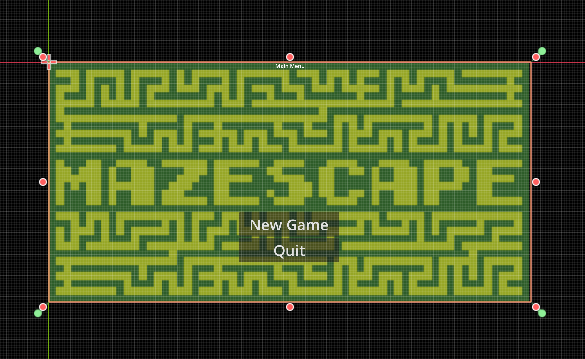
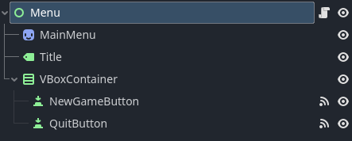
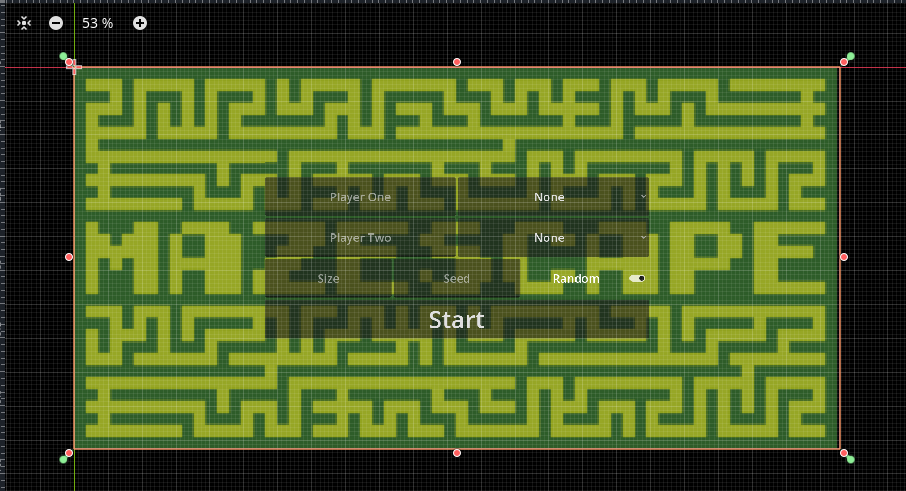
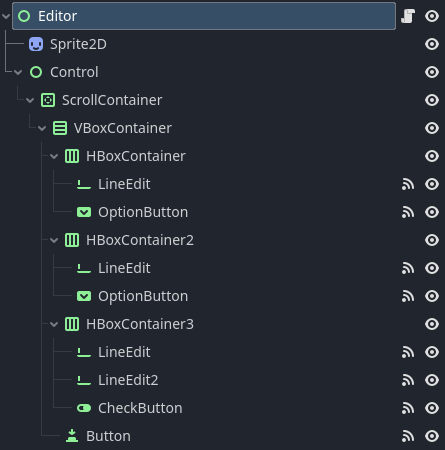

# INFORME

Proyecto de la asignatura de Programación de Ciencia de la Computación.

## Resumen

El proyecto es un juego multijugador para dos personas, contrarios entre sí. El objetivo de cada jugador es llegar a la salida antes que el oponente en un laberinto generado para cada partida. Habrá trampas que entorpecerán a los jugadores, quitándoles ventaja y dominio sobre el laberinto. Contrarrestarlas es el uso principal de las habilidades a elegir.

Las habilidades son únicas por ficha, y hay 5 para elegir. Los jugadores las usan para esquivar trampas o desfavorecer al oponente.

## Dependencias y ejecución

Hecho en Godot v4.3.stable.mono.official [77dcf97d8].

En [Game](../Game/) habrá un archivo ejecutable del juego exportado solo para _Windows_.

## Flujo e interacciones

### Menú

Al abrir el juego, se presentará el Menú junto al título. Si decides iniciar un nuevo juego, te enviará al `Editor`.

- `New Game`

  > Inicia el juego.

- `Quit`

  > Abandona el juego.

---

Esta escena contiene un solo _script_ [Menu](../Scripts/Menu.cs).

---

### Editor

Su función es configurar la partida. Sus opciones son:

1. Cambiar el nombre del jugador 1, escribiendo sobre el panel "Player One".

> Si no se elige un nombre, se asignará a los jugadores 1 y 2: "Player One" y "Player Two" respectivamente.

2. Elegir o no la habilidad del jugador 1, seleccionando una de las opciones del control "No Skill".

> Los puntos 1 y 2 son iguales para el jugador 2, en los controles de "Player Two".

3. Elegir tamaño del laberinto, escribiendo sobre el control "Size".

4. Elegir el laberinto generado por una semilla aleatoria o predefinida, sobre los controles "Random" y "Seed".

> Para elegir una semilla predefinida, tienes que escribirla sobre el panel "Seed" y desactivar el botón "Random".

5. Iniciar la partida, presionando el botón "Start".

> Con las opciones elegidas en los puntos 1, 2, 3 y 4 iniciarás una partida.

---

La escena contiene un script en su nodo base [Editor](../Scripts/Editor.cs).

---

#### Controles

Las teclas son detectadas mediante el _Input Map_ de _Godot_.

_Player One_

- Moverse:

  - Derecha: `A`.

  - Izquierda: `D`.

  - Arriba: `W`.

  - Abajo: `S`.

- Cambiar cámara: `E`.

- Habilidad: `F`.

_Player Two_

- Moverse:

  - Derecha: `I`.

  - Izquierda: `L`.

  - Arriba: `J`.

  - Abajo: `K`.

- Cambiar cámara: `U`.

- Habilidad: `H`.

## Estructura

### Clases

El código está separado en parte [Visual](../Scripts), [Lógica](../Scripts/Logic/) y de [Datos](../Scripts/Data/), separado del resto del proyecto.

#### Casillas

- [Tile](../Scripts/Data/Tile.cs): Clase casilla del laberinto. El laberinto es un array bidimensional de casillas. En esta clase están definidos los componentes de la coordenada de las casillas.

- [Empty y Wall](../Scripts/Data/Tile.cs): Derivan de la clase Tile, representan el camino que puede recorrer el jugador y el que no puede atravesar respectivamente.

- [Trap](../Scripts/Data/Tile.cs): Clase abstracta derivada de Empty, representa una trampa. Tiene un booleano `IsActive` que muestra si la trampa está activada o no, junto a dos métodos `Activate()` y `Deactivate()`.

- [Spikes](../Scripts/Data/Tile.cs): Derivada de Trap, trampa de púas. Reduce la velocidad del jugador en un 10% por 10 segundos.

  > Posee una propiedad `Timer` de 10000 milisegundos.

- [Portal](../Scripts/Data/Tile.cs): Derivada de Trap, trampa de portal. Traslada al jugador a una casilla vacía vecina.

- [Shock](../Scripts/Data/Tile.cs): Derivada de Trap, trampa eléctrica. Paraliza al jugador y para liberarse tendrá que tratar de moverse 10 veces.

  > Posee una propiedad `Struggle` de 10.

#### Habilidades

- [Skill](../Scripts/Data/Skill.cs#L3): Clase abstracta habilidad del jugador. Tiene costo de energía según la habilidad.

  > Posee una propiedad `BatteryLife`.

- [Shield](../Scripts/Data/Skill.cs#L12): Derivada de la clase Skill, escudo contra trampas. Activado permite al jugador atravesar trampas.

  > `BatteryLife = 20`

- [Portal Gun](../Scripts/Data/Skill.cs#L17): Derivada de la clase Skill, lanza-portales. Activada permite atravesar paredes.

  > `BatteryLife = 20`

- [Blind](../Scripts/Data/Skill.cs#L22): Derivada de la clase Skill, ceguera. Activada provoca ceguera al contrario.

  > `BatteryLife = 20`

  > `Timer = new(10000)`, 10000 milisegundos.

- [Muter](../Scripts/Data/Skill.cs#L29): Derivada de la clase Skill, silenciador. Activada prohíbe al contrario usar su habilidad por un tiempo predefinido.

  > `BatteryLife = 20`

  > `Timer = new(10000)`, 10000 milisegundos.

- [Glare](../Scripts/Data/Skill.cs#L36): Derivada de la clase Skill, mirada de odio. Activada paraliza al contrario por un tiempo predefinido.

  > `BatteryLife = 20`

  > `Timer = new(10000)`, 10000 milisegundos.

  > `Radius = 20`

#### Generador de laberintos

Al instanciar [Maze Generator](../Scripts/Logic/MazeGenerator.cs) se crea recibiendo de parámetros tamaño y semilla predefinida o aleatoria; para luego generar un array bidimensional de casillas con `GenerateMaze()`.

#### Global

[Global](../Scripts/Global.cs) es un nodo que está presente durante el curso del juego. Tendrá propiedades que son usadas entre escenas.

#### Board

[Board](../Scripts/Board.cs) es una clase derivada de TileMapLayer, pinta el laberinto en el mundo del juego junto a las colisiones de las paredes del laberinto.

#### Editor

[Editor](../Scripts/Editor.cs) es una clase derivada de Control, maneja la escena para configurar el laberinto y los personajes. Permite elegir nombres a los jugadores, una habilidad de 5, tamaño del laberinto y una semilla predefinida o aleatoria.

#### World

[World](../Scripts/World.cs) es una clase derivada de Node2D, es el mundo del juego. Cuando aparece en escena genera el laberinto.

#### Player

[Player](../Scripts/Player.cs) es una clase derivada de CharacterBody2D, representa a los jugadores en el juego. Maneja el movimiento, habilidades y estados del jugador.

#### PlayerCamera

[PlayerCamera](../Scripts/PlayerCamera.cs#L50) es una clase derivada de Camera2D, maneja la cámara del jugador. Tiene tres estados: Player, Free y Extensive.

#### PlayerUi

[PlayerUi](../Scripts/PlayerUi.cs) es una clase derivada de Control, maneja la interfaz de usuario del jugador. Muestra el nombre del jugador, la habilidad y la energía.

#### PlayerTwoSubViewport

[PlayerTwoSubViewport](../Scripts/PlayerTwoSubViewport.cs) es una clase derivada de SubViewport, maneja el subviewport del segundo jugador.

#### GameOver

[Game Over](../Scripts/GameOver.cs) es una clase derivada de Node2D, cuando termina el juego muestra quién de los jugadores ganó o perdió.

Si presionas el botón `Restart`, cambiará a la escena Editor. Si presionas `Menu`, te cambiará a la escena del Menú.

## Extra

### Vídeos del desarrollo

[Generación por ruido en Godot 4.3](../Informe/Grabación%20de%20pantalla%202024-12-15%20234950.mp4)
[Intento de discretizar el movimiento](../Informe/Grabación%20de%20pantalla%202024-12-31%20212633.mp4)
[Probando las trampas](../Informe/Grabación%20de%20pantalla%202025-01-07%20084955.mp4)
[Probando las trampas 2](../Informe/Grabación%20de%20pantalla%202025-01-10%20022538.mp4)